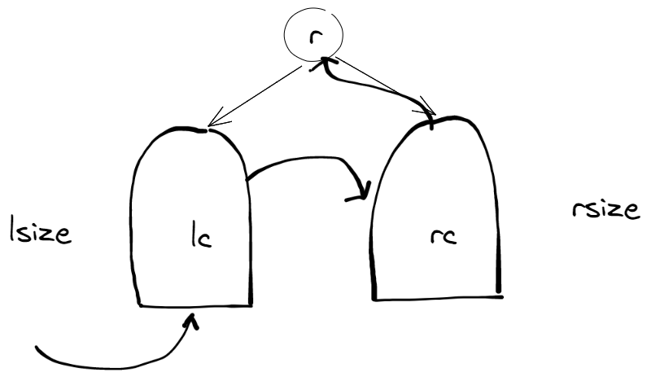

+ 绘制如下图表示遍历顺序


+ 不难写出如下代码

```c++
BinNode * rank(BinNode *t ,int k){
    if(!t || t->size < k) return NULL;//如果是为空树或者全树的规模小于k则返回NULL

    if(t->size == k ) return size; //K刚好为全树的规模根据后续遍历的特点返回根节点

    if(!t->lc) return rank(t->rc, k);//没有左子树则直接到右子树中搜索

    int lsize  = t->lc->size;

    if(lszie >= k)  return rank(t->lc , k);//k小于左子树规模直接在左子树中查找
    else return rank(t->rc,k - lszie);//否则到右子树中查找在此之前必然已经跳过左子树规模
}
```
+ 算法解释在代码注释中

+ 复杂度正比于全树高度o(depth(x)) 空间复杂度o(1)
