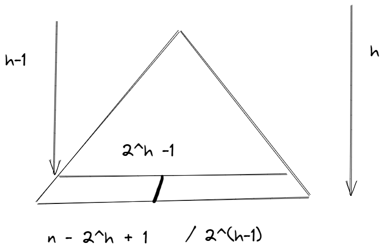

# 1
+ 首先绘制出如下图所示的完全二叉树他的节点包括h-1层满二叉树和第h层不满的节点



+ 节点数为n的二叉树高度应该是 $\log_2 n$取下整
+ 高度为h-1的满二叉树节点数为2^h -1
+ 设b为h-1的满二叉树节点
+ 设a为最后一层节点数那么最后一次取值会在n-b和2^(h-1)之间
+ 所以最后的左子树节点数为b/2 + min(n-b2^(h-1))

# 2
```c++
int LSize(int n){
    int h = log(n)/ log(2);
    int b = pow(2, h);
    int a = min(n - b,b / 2);
    return Lsize = b / 2 - 1  + a;//根节点记为左子树中
}
```

# 3
```c++
BinNodePosi*(T) searchK(BinNodePosi*(T) root){
    int Lsize = root ->lc->size;
    if(Lsize <= k)
        return searchK(root->lc,k);
    else if(Lsize + 1==k)
        return root;
    else
        return searchK(root->rc,k - Lsize);
} 
```
# 4
```c++
void splayTo(BinNodePosi*(T) a,BinNodePosi*(T) x){
    if(a == x->parent) return;//如果已经是root的孩子直接返回
    else if(a == x->parent->parent){//x是a的直接孙子，只需要一次旋转
        if(isLChild(x)) zig(x->parent);
        else zag(x->parent);
    }else{//x不是a的直接孙子
    	BinNodePosi(T) p = x->parent;
    	BinNodePosi(T) g = p->parent;
       
            if(isLchild(p)&&isLchild(x)) {zig(g);zig(p);}
       else if(isRchild(p)&&isRchild(x)) {zag(g);zag(p);}
       else if(isLchild(p)&&isRchild(x)) {zag(p);zig(g);}
       else if(isRchild(p)&&isLchild(x)) {zig(p);zag(g);} 
       splyto(a,x);//继续检查a和x的关系,做递归的旋转
    }
}
```
# 5
```c++
BinNodePosi*(T) toCBT(BinNodePosi*(T) root){
    if(!root) return NULL;//空树直接返回
    if(!root->lc&&!root->rc) return root;//仅有根节点
    int Lsize = Lsize(root->size);
    BinNodePosi*(T) newRoot = searchK(root,Lsize+1);//寻找完全二叉树根节点
    splayTo(root,newRoot);
    toCBT(newRoot->lc);
    toCBT(newRoot->rc);
    return newRoot;
}
```
#  6
+ lSize函数的复杂度为 O(1)
+ searchK函数的复杂度为 O(logn)
+ splyT0函数的复杂度为 O(logn)
+ 所以 toCBT函数单次迭代的复杂度为   O(1) + O(logn) + O(logn) = O(logn)
+ 总计有n个结点需要迭代，故toCBT函数总体时间复杂度为 n× O(logn) =  O(nlogn)
+ 而二叉树高度 h =  O(logn)，故迭代深度不超过O(logn)。
